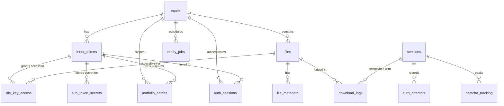

# GhostDrop — Application Source (`Ghost_Drop/`)

This directory contains the complete, deployable application: an Express.js backend, a Vanilla JS frontend, Docker configuration, and technical reference documentation.

---

## Table of Contents

- [Purpose and Scope](#purpose-and-scope)
- [Directory Layout](#directory-layout)
- [Core Concepts](#core-concepts)
- [Database Schema](#database-schema)
- [Index Design and Query Mapping](#index-design-and-query-mapping)
- [Security Architecture](#security-architecture)
- [Encryption Architecture](#encryption-architecture)
- [API Reference](#api-reference)
- [Frontend](#frontend)
- [Background Services](#background-services)
- [Setup](#setup)
- [Docker](#docker)
- [Environment Variables](#environment-variables)
- [Key Files](#key-files)
- [Technical Notes](#technical-notes)

---

## Purpose and Scope

This module serves three layered purposes:

1. **Ephemeral file vault** — time-limited, encrypted file storage and sharing via a dual-token access model  
2. **RBAC Portfolio API** — an authenticated, vault-scoped CRUD surface demonstrating role enforcement, per-row integrity hashing, and tamper detection  
3. **SQL index demonstration** — production-quality composite indexes with a startup reconciler and query-to-index mapping evidence

---

## Directory Layout

```
Ghost_Drop/
├── backend/
│   ├── src/
│   │   ├── app.js                    Server entry — startup validation, route mounting, graceful shutdown
│   │   ├── config/
│   │   │   ├── db.js                 MySQL connection pool (mysql2)
│   │   │   ├── drive.js              Google Drive client (service account or OAuth2)
│   │   │   ├── logger.js             Pino logger (JSON + pretty-print)
│   │   │   ├── securityPolicies.js   Per-route rate-limit and risk-policy config
│   │   │   └── validateEnv.js        Startup env validation (fails fast on bad config)
│   │   ├── middleware/
│   │   │   ├── securityGate.js       IP block · risk score · CAPTCHA · rate limit — applied per route
│   │   │   ├── authSession.js        requireAuth / requireAdmin Bearer session middlewares
│   │   │   └── upload.js             Multer disk/memory config + file-size limits
│   │   ├── routes/
│   │   │   ├── auth.js               POST /api/auth/login · GET /api/auth/isAuth
│   │   │   ├── vaults.js             Vault creation, access, sub-token management, QR
│   │   │   ├── files.js              Upload (multi-file), download, batch ZIP, sub-token reveal
│   │   │   ├── portfolio.js          RBAC CRUD for portfolio_entries
│   │   │   ├── security.js           Tamper detection endpoint
│   │   │   └── moduleB.js            Module B integration route
│   │   └── services/
│   │       ├── crypto.js             Token generation, PBKDF2 hash/verify, HMAC lookup hash
│   │       ├── fileSecurityMetadata.js  AES-256-GCM encryption, key wrapping/unwrapping
│   │       ├── driveService.js       Google Drive upload/download/delete wrappers
│   │       ├── security.js           Rate limiting, IP risk, CAPTCHA, adaptive blocking
│   │       ├── authSession.js        Session creation, lookup, expiry
│   │       ├── vaultAccess.js        Vault resolution and token verification helpers
│   │       ├── vaultCleanup.js       Background expired-vault purge service
│   │       ├── portfolioIntegrity.js SHA-256 row integrity hash, tamper scan
│   │       ├── fileAuditLogger.js    Append-only audit log writer
│   │       ├── auditService.js       Session creation, auth attempt logging, expiry job upsert
│   │       ├── filePathSchema.js     Lazy schema migration for relative_path column
│   │       ├── fileValidation.js     MIME type + extension allowlist validation
│   │       ├── portfolioService.js   Portfolio entry creation helper
│   │       └── schemaOptimization.js Startup index reconciler
│   ├── sql/
│   │   └── init_schema.sql           Complete schema: 13 tables, indexes, trigger
│   ├── scripts/
│   │   ├── backfill_metadata.js      Backfill file_metadata for legacy rows
│   │   ├── export_db.js              Export database snapshot to JSON
│   │   └── migrate_legacy_file_encryption.js  Encrypt pre-AES files in place
│   ├── .env.example                  Annotated environment variable reference
│   └── package.json
├── frontend/
│   ├── index.html                    SPA shell
│   ├── app.js                        All frontend logic (~56 KB, no framework)
│   └── styles.css                    All styles (~28 KB)
├── docs/
│   ├── ENCRYPTION_REFERENCE.md       Deep-dive: key hierarchy, envelope encryption, threat model
│   ├── JSON_API_REQUESTS_PRO_GUIDE.md  Full API request/response examples
│   ├── SECURITY_LIMITS_REFERENCE.md  Rate-limit tiers, adaptive block policy, IP risk scoring
│   └── PROJECT_DOCUMENTATION.md     Overall architecture reference
├── Dockerfile                        Node 20 Alpine, non-root user, health check
└── docker-compose.yml                App + MySQL 8 + Redis 7
```

---

## Core Concepts

### Dual-Token Vault Model

Every vault has two token types:

| Token | Who holds it | Stored how | Role |
|---|---|---|---|
| **Outer token** | Public (QR-shareable) | Plaintext — it is only a vault identifier | Identifies the vault |
| **MAIN inner token** | Creator only | PBKDF2 hash + salt | `admin` — full access |
| **SUB inner token** | Recipient | PBKDF2 hash + salt | `user` — scoped file access |

The inner token is the single secret that controls access. It is **never stored in plaintext** — only its PBKDF2 hash survives.

### RBAC Without a User Table

There is no traditional user/password table. Role assignment is derived entirely from the token type:

```
outerToken + MAIN innerToken  →  role: admin
outerToken + SUB  innerToken  →  role: user
```

`admin` can upload, create/revoke SUB tokens, manage all portfolio entries, and reveal SUB token secrets.  
`user` can download files linked to their token and read/update their own portfolio entries.

---

## Database Schema



### Table Reference

| Table | Key Columns | Purpose |
|---|---|---|
| `vaults` | `vault_id`, `outer_token` (UNIQUE), `expires_at`, `status` | Vault lifecycle |
| `inner_tokens` | `inner_token_id`, `token_type`, `token_hash`, `token_lookup_hash`, `salt` | Token credential store |
| `files` | `file_id`, `drive_file_id` (UNIQUE), `file_key_iv`, `file_auth_tag`, `file_hmac` | Encrypted file records |
| `file_metadata` | `file_id` (UNIQUE FK), `relative_path` | Extended path/MIME metadata |
| `file_key_access` | `(file_id, inner_token_id)` UNIQUE, `encrypted_file_key`, wrap metadata | Per-token wrapped file key |
| `sub_token_secrets` | `inner_token_id` (PK), `secret_ciphertext`, `secret_iv`, `secret_version` | AES-encrypted raw SUB token |
| `sessions` | `session_id`, `ip_address` | Anonymous session tracking |
| `auth_sessions` | `session_token`, `role`, `expires_at`, `revoked_at` | Bearer session store |
| `auth_attempts` | `session_id`, `vault_id`, `success` | Auth audit trail |
| `download_logs` | `file_id`, `inner_token_id`, `download_time` | Download audit trail |
| `captcha_tracking` | `session_id` (UNIQUE), `attempts`, `required` | CAPTCHA state per session |
| `expiry_jobs` | `vault_id` (UNIQUE), `scheduled_time`, `processed` | Background cleanup queue |
| `portfolio_entries` | `entry_id`, `integrity_hash`, `status` | RBAC CRUD resource |

---

## Index Design and Query Mapping

All indexes are defined in [`backend/sql/init_schema.sql`](backend/sql/init_schema.sql). The startup reconciler in `services/schemaOptimization.js` adds any missing indexes on boot without requiring a full schema migration.

| Query Pattern | Index Used | Rationale |
|---|---|---|
| `WHERE outer_token = ?` | `UNIQUE` key on `vaults.outer_token` | Token lookup is always exact-match; UNIQUE key suffices |
| `WHERE status = ? ORDER BY expires_at` | `idx_vault_expiry (status, expires_at)` | Covering composite for cleanup scan |
| `WHERE token_lookup_hash = ? AND vault_id = ? AND status = ?` | `idx_inner_tokens_lookup_hash` | Fast pre-filter before slow PBKDF2 verify |
| `WHERE vault_id = ? AND status = ? ORDER BY created_at DESC` | `idx_files_vault_status` | File listing per vault |
| `WHERE deleted_at IS NOT NULL` | `idx_files_deleted_at` | Cleanup scans for logically deleted files |
| `WHERE file_id = ? ORDER BY download_time DESC` | `idx_download_file_time` | Per-file download history |
| `WHERE inner_token_id = ?` on `download_logs` | `idx_download_token` | Per-token download audit |
| `WHERE session_id = ? ORDER BY attempt_time DESC` | `idx_auth_attempts_session_time` | Session-scoped attempt lookup |
| `WHERE vault_id = ? AND status = ? ORDER BY updated_at DESC` | `idx_portfolio_vault_status` | Portfolio list (admin view) |
| `WHERE vault_id = ? AND owner_token_id = ? AND status = ? ORDER BY updated_at DESC` | `idx_portfolio_vault_owner_status` | Portfolio list (user view) |
| `WHERE integrity_hash = ?` | `idx_portfolio_integrity_hash` | Tamper detection scan |

---

## Security Architecture

### Security Gate (Applied Per Route)

`middleware/securityGate.js` wraps all public endpoints. On every request it runs:

```
1. Temporary block check      — 429 + Retry-After if IP is blocked
2. IP risk evaluation         — score TOR / VPN / bad-IP list membership
3. CAPTCHA gate               — demanded on accumulated failures or high risk score;
                                accepts built-in math, hCaptcha, or reCAPTCHA tokens
4. Global IP rate limit       — 10 req/min · 100 req/day (per-IP sliding window)
5. Per-route rate limit       — separate counters keyed by routeKey (e.g. "files.download")
6. Adaptive block escalation  — 15 min on first strike, doubles per strike, cap 24 h
```

### Portfolio Principal Rate Limit (Layer 7)

Applied in `routes/portfolio.js` after auth, keyed on `portfolio:{vaultId}:{innerTokenId}`:  
60 req/min · 600 req/day per authenticated token.

### Row-Level Tamper Detection

Each `portfolio_entries` row stores:

```
integrity_hash = SHA-256(vaultId | ownerTokenId | title | content | status | INTEGRITY_SECRET)
```

On every read, update, and delete the hash is recomputed and compared. Mismatch returns `409 PORTFOLIO_TAMPER_DETECTED`.

`GET /api/security/unauthorized-check` scans the entire vault's entries for tampering.  
The background integrity scanner (`PORTFOLIO_INTEGRITY_SCAN_INTERVAL_MS`) does the same system-wide on a configurable interval.

### SQL Trigger Guard

`before_portfolio_update_guard` (defined in `init_schema.sql`) fires on every UPDATE to `portfolio_entries` and signals `SQLSTATE '45000'` if:
- `created_at` is changed
- `created_by_token_id` is changed

This blocks tampering even via direct SQL access to the database.

### Constant-Time Token Comparison

All inner token verifications use `crypto.timingSafeEqual` on equal-length hex buffers derived from PBKDF2. This prevents timing-oracle attacks.

---

## Encryption Architecture

Full reference: [`docs/ENCRYPTION_REFERENCE.md`](docs/ENCRYPTION_REFERENCE.md)

### Primitives

| Primitive | Where Used | Why |
|---|---|---|
| `PBKDF2-HMAC-SHA256` | Inner token hashing (250 000 iterations, 16-byte random salt) | Brute-force resistance |
| `HMAC-SHA256` | Token lookup pre-filter (`TOKEN_LOOKUP_SECRET`) | Fast DB filter before slow PBKDF2 |
| `AES-256-GCM` | File encryption, file key wrapping, SUB token secret storage | AEAD — confidentiality + integrity in one pass |
| `SHA-256` | Plain-file hash (`file_plain_hash`), portfolio integrity hash | Secondary integrity verification |
| `crypto.randomBytes` | All IVs, salts, file keys | Cryptographically secure randomness |
| `crypto.timingSafeEqual` | Token comparison | Prevents timing-oracle attacks |

### Envelope Encryption (File Keys)

```
1. Generate: fileKey = randomBytes(32)
2. Encrypt:  ciphertext = AES-256-GCM(fileKey, plaintext)
             → stored on Google Drive (ciphertext + authTag only)
3. Wrap:     wrappingKey = PBKDF2(innerToken, wrapSalt, 200 000 iters)
             wrappedKey  = AES-256-GCM(wrappingKey, fileKey)
             → stored in MySQL file_key_access
```

Each file has its own random key. Multiple tokens can each hold a copy of the same wrapped key — adding a SUB token copies the `file_key_access` row without re-encrypting the file.

### SUB Token Secret Storage

The raw SUB inner token is encrypted at rest in `sub_token_secrets` so an admin can later retrieve it:

```
ciphertext = AES-256-GCM(SUB_TOKEN_SECRET_KEY, rawSubToken)
```

Stored fields: `secret_ciphertext`, `secret_iv`, `secret_auth_tag`, `secret_version`.  
`secret_version` supports future key rotation without breaking existing records.

---

## API Reference

Full examples with headers and response shapes: [`docs/JSON_API_REQUESTS_PRO_GUIDE.md`](docs/JSON_API_REQUESTS_PRO_GUIDE.md)

### Auth

```http
POST   /api/auth/login          Body: { outerToken, innerToken }
                                 Returns: { sessionToken, role, tokenType, expiresAt }

GET    /api/auth/isAuth          Header: Authorization: Bearer <sessionToken>
                                 Returns: { authenticated, role, vaultId, remainingSeconds }
```

### Vaults

```http
POST   /api/vaults                      Body: { innerToken, expiresInDays }
                                         Returns: { outerToken, expiresInDays }

GET    /api/vaults/:outer/public-info   Returns: { status, expiresAt, remainingSeconds, activeFileCount }

POST   /api/vaults/:outer/access        Body: { innerToken }
                                         Returns: { tokenType, canCreateSubToken, files[] }

POST   /api/vaults/:outer/sub-tokens    Body: { mainInnerToken, fileIds[], subInnerToken? }
                                         Returns: { subTokenId, subInnerToken, linkedFileCount }

GET    /api/vaults/:outer/qr            Returns: { outerToken, qrDataUrl }
```

### Files

```http
POST   /api/files/:outer/upload            Multipart: files[], innerToken, relativePaths[]?
GET    /api/files/:outer/download/:fileId  Query: innerToken → streams decrypted file
POST   /api/files/:outer/download-batch    Body: { innerToken, fileIds[] } → streams ZIP
GET    /api/files/:outer/sub-tokens/:id/reveal   Body: { mainInnerToken } → returns raw SUB token
```

### Portfolio *(Bearer required)*

```http
GET    /api/portfolio              Lists entries (admin: all; user: own)
GET    /api/portfolio/:entryId     Single entry with tamper check
POST   /api/portfolio              Admin only — Body: { title, content, ownerTokenId? }
PUT    /api/portfolio/:entryId     Admin or owner — Body: { title?, content?, ownerTokenId? }
DELETE /api/portfolio/:entryId     Admin only — soft-delete with integrity hash update
```

### Security *(Bearer + admin required)*

```http
GET    /api/security/unauthorized-check   Scans vault portfolio entries for tampered rows
```

### Health

```http
GET    /api/health    → { status: "ok" }           DB ping
GET    /api/ready     → { status: "ready", ... }   DB + Redis readiness
```

---

## Frontend

The frontend is a self-contained Vanilla JS SPA with no build step:

| File | Size | Contents |
|---|---|---|
| `frontend/index.html` | ~25 KB | SPA shell, all markup and screen states |
| `frontend/app.js` | ~57 KB | All client logic — vault creation, upload, download, QR scanning, portfolio UI |
| `frontend/styles.css` | ~28 KB | All styles |
| `frontend/lucide.js` | ~590 KB | Bundled Lucide icon set |

Key UX details:
- Outer token can be **typed or scanned** with the browser camera (uses `getUserMedia` + canvas)
- CAPTCHA challenge is presented inline; after a successful solve the pending action is retried automatically
- Batch ZIP download is assembled server-side and streamed to the browser

The frontend is served by Express as static files from the same port (`/` → `index.html`).

---

## Background Services

### Vault Cleanup (`services/vaultCleanup.js`)

Runs on a configurable interval (default 10 minutes). Each cycle:

1. Queries vaults with `expires_at < NOW() - graceHours` and `status IN ('ACTIVE', 'EXPIRED')`
2. For each purgeable vault:
   - Fetches all `files` with `drive_file_id`
   - Calls Google Drive API to delete each file
   - Opens a DB transaction and deletes: `download_logs`, `file_key_access`, `file_metadata`, `files`, `inner_tokens`, `auth_sessions`, `expiry_jobs`
   - Marks the vault `status = 'PURGED'` (or deletes it)
3. Logs results via Pino

| Env Variable | Default | Effect |
|---|---|---|
| `VAULT_CLEANUP_INTERVAL_MS` | `600000` | How often the scan runs |
| `VAULT_CLEANUP_GRACE_HOURS` | `1` | Hours after expiry before purge |
| `VAULT_CLEANUP_BATCH_SIZE` | `20` | Max vaults processed per cycle |

### Portfolio Integrity Scanner (`app.js`)

When `PORTFOLIO_INTEGRITY_SCAN_INTERVAL_MS > 0`, the server runs a background scan across all `portfolio_entries` and appends `CRITICAL` severity audit log entries for any tampered rows.

---

## Setup

### Prerequisites

- Node.js 20+
- MySQL 8.0+
- Google Drive API credentials (service account recommended for production)

### Database Initialisation

```bash
# Linux / macOS / Git Bash
mysql -u root -p < backend/sql/init_schema.sql

# PowerShell
Get-Content ".\backend\sql\init_schema.sql" | mysql --force -u root -p ghostdrop_proto
```

### Generate Required Secrets

```bash
node -e "console.log(require('crypto').randomBytes(48).toString('hex'))"
# Run twice — once for TOKEN_LOOKUP_SECRET, once for SUB_TOKEN_SECRET_KEY
```

### Install and Start

```bash
cp backend/.env.example backend/.env
# → fill in DB credentials, GOOGLE_DRIVE_FOLDER_ID, GOOGLE_SERVICE_ACCOUNT_KEY_FILE,
#   TOKEN_LOOKUP_SECRET, SUB_TOKEN_SECRET_KEY

cd backend
npm install
npm run dev        # development (nodemon hot-reload)
```

Server: `http://localhost:4000` · Health: `http://localhost:4000/api/health`

### Google Drive — OAuth2 Alternative

If you do not have a service account:

```bash
# Set GOOGLE_CLIENT_ID and GOOGLE_CLIENT_SECRET in .env first, then:
node backend/get_refresh_token.js
# → follow the browser prompt, paste the returned refresh token into GOOGLE_REFRESH_TOKEN
```

---

## Docker

```bash
# Build and start app + MySQL 8 + Redis 7
docker compose up --build -d

# Stream logs
docker compose logs -f app

# Stop
docker compose down
```

The `docker-compose.yml` uses health checks on MySQL and Redis — the app container only starts after both are ready.

The Dockerfile:
- Base: `node:20-alpine`
- Runs as a non-root user (`ghostdrop`, UID 1001)
- Only production dependencies (`npm ci --only=production`)
- Built-in health check against `/api/health`

---

## Environment Variables

Full annotated reference: [`backend/.env.example`](backend/.env.example)

### Server

| Variable | Default | Notes |
|---|---|---|
| `PORT` | `4000` | |
| `NODE_ENV` | `development` | Set `production` in prod |
| `TRUST_PROXY` | `false` | Set `true` behind nginx/Railway/Render |
| `LOG_LEVEL` | `info` | Pino log level |

### Database

| Variable | Default |
|---|---|
| `DB_HOST` | `127.0.0.1` |
| `DB_PORT` | `3306` |
| `DB_USER` | `root` |
| `DB_PASSWORD` | *(required)* |
| `DB_NAME` | `ghostdrop_proto` |
| `DB_CONNECTION_LIMIT` | `20` |

### Security (required in production)

| Variable | How to generate |
|---|---|
| `TOKEN_LOOKUP_SECRET` | `node -e "console.log(require('crypto').randomBytes(48).toString('hex'))"` |
| `SUB_TOKEN_SECRET_KEY` | Same command |
| `SECURITY_STORE` | `memory` (dev) or `redis` (prod) |
| `REDIS_URL` | `redis://:password@host:6379` |

### Google Drive

| Variable | Notes |
|---|---|
| `GOOGLE_DRIVE_FOLDER_ID` | Target folder for ciphertext uploads |
| `GOOGLE_SERVICE_ACCOUNT_KEY_FILE` | Path to service account JSON |
| `GOOGLE_CLIENT_ID / SECRET / REFRESH_TOKEN` | OAuth2 alternative |


### Upload / Security Limits


| Variable | Default | Notes |
|---|---|---|
| `PBKDF2_ITERATIONS` | `250000` | Token hashing strength |
| `FILE_KEY_WRAP_ITERATIONS` | `200000` | File key wrapping strength (tunable independently) |
| `MAX_FILE_SIZE_MB` | `10` | Per-file upload limit |
| `MAX_FILES_PER_UPLOAD` | `20` | Files per upload batch |
| `MAX_VAULT_SIZE_MB` | `250` | Total storage per vault |
| `BATCH_DOWNLOAD_MAX_FILES` | `10` | Max files in one ZIP download |
| `CAPTCHA_PROVIDER` | `math` | `math`, `hcaptcha`, or `recaptcha` |
| `CORS_ORIGIN` | *(empty)* | Comma-separated allowed origins |

### Background Services

| Variable | Default | Notes |
|---|---|---|
| `VAULT_CLEANUP_INTERVAL_MS` | `600000` | Background vault purge scan interval |
| `VAULT_CLEANUP_GRACE_HOURS` | `1` | Hours after expiry before purging |
| `VAULT_CLEANUP_BATCH_SIZE` | `20` | Max vaults purged per cycle |
| `PORTFOLIO_INTEGRITY_SCAN_INTERVAL_MS` | `0` | Background integrity scan interval (0 = off) |
| `PORTFOLIO_INTEGRITY_SECRET` | *(required in prod)* | HMAC key for portfolio row hashing |
| `AUDIT_LOG_BLOCK_SIZE` | `1000` | Max audit.log entries before rotation |

---

## Key Files

| File | What to read there |
|---|---|
| [`backend/src/app.js`](backend/src/app.js) | Startup sequence, route mounting, graceful shutdown |
| [`backend/src/middleware/securityGate.js`](backend/src/middleware/securityGate.js) | Full security gate pipeline |
| [`backend/src/services/crypto.js`](backend/src/services/crypto.js) | Token generation, PBKDF2, HMAC lookup |
| [`backend/src/services/fileSecurityMetadata.js`](backend/src/services/fileSecurityMetadata.js) | AES-256-GCM encrypt/decrypt, key wrap/unwrap |
| [`backend/src/services/security.js`](backend/src/services/security.js) | Rate limiting, adaptive blocking, IP risk, CAPTCHA |
| [`backend/src/services/portfolioIntegrity.js`](backend/src/services/portfolioIntegrity.js) | Integrity hash computation and tamper detection |
| [`backend/src/services/vaultCleanup.js`](backend/src/services/vaultCleanup.js) | Background vault purge service |
| [`backend/sql/init_schema.sql`](backend/sql/init_schema.sql) | Full schema, indexes, and trigger |
| [`docs/ENCRYPTION_REFERENCE.md`](docs/ENCRYPTION_REFERENCE.md) | Deep-dive on envelope encryption |
| [`docs/JSON_API_REQUESTS_PRO_GUIDE.md`](docs/JSON_API_REQUESTS_PRO_GUIDE.md) | Full API request/response examples |
| [`docs/SECURITY_LIMITS_REFERENCE.md`](docs/SECURITY_LIMITS_REFERENCE.md) | Rate-limit tiers, adaptive block policy, IP risk |

---

## Technical Notes

- **In-memory vs Redis security store:** In development, rate-limit counters live in a Node.js `Map`. In production (`NODE_ENV=production`), `SECURITY_STORE=redis` is enforced at startup; the process refuses to start without it.

- **PBKDF2 is async:** `hashInnerToken` and `verifyInnerToken` use `util.promisify(crypto.pbkdf2)` to avoid blocking the event loop during 250 000-iteration derivations.

- **Lookup hash pre-filter:** Because PBKDF2 is slow, a fast `HMAC-SHA256(token, TOKEN_LOOKUP_SECRET)` hash is stored in `inner_tokens.token_lookup_hash`. The DB query uses this to narrow candidates before the full PBKDF2 comparison.

- **Legacy fallback:** Tokens inserted before `token_lookup_hash` existed have `NULL` in that column. The access route falls back to a full table scan (limited to 20 rows) and backfills the hash on first successful match.

- **File key wrapping iterations:** File key wrapping uses a separate `FILE_KEY_WRAP_ITERATIONS` env var (default 200 000) to allow independent tuning from token hashing.

- **SUB token reveal:** The admin can retrieve the raw SUB inner token via `GET /api/files/:outer/sub-tokens/:tokenId/reveal`. It is decrypted on-the-fly from `sub_token_secrets` using `SUB_TOKEN_SECRET_KEY`.

- **Batch download cap:** `BATCH_DOWNLOAD_MAX_FILES` (default 10) caps the number of files per ZIP request to prevent memory exhaustion from assembling large archives server-side.

- **JSON body size limit:** Request bodies are capped at 50 KB (`express.json({ limit: "50kb" })`) to prevent JSON DoS.

- **HSTS disabled in dev:** Helmet's HSTS header is only enabled when `NODE_ENV=production` to prevent browsers from caching the dev server as HTTPS-only.
