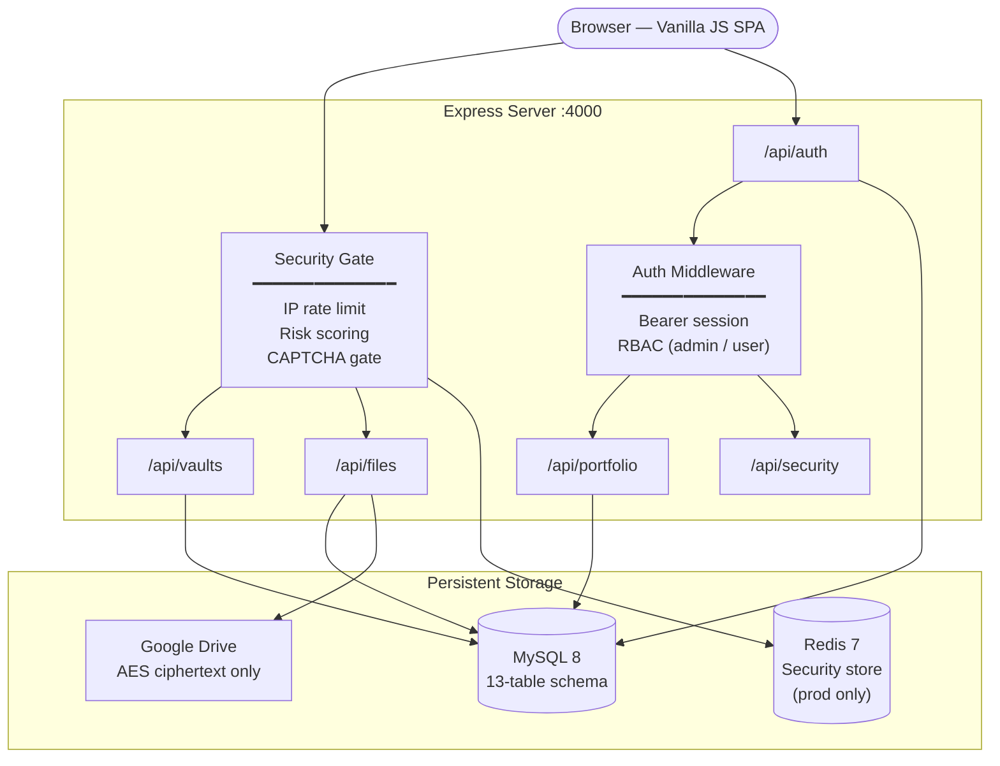
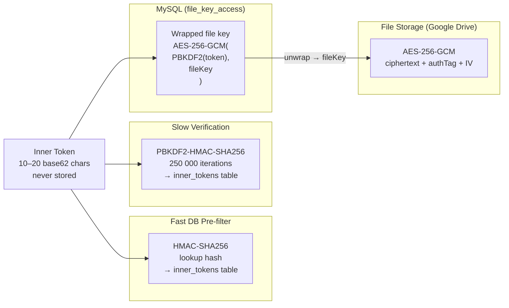

# GhostDrop — Privacy-Focused Ephemeral File Vault

> A production-ready, full-stack secure file-sharing system built from scratch.  
> Files are **AES-256-GCM encrypted before leaving the server**. Google Drive stores ciphertext only. Vaults self-destruct on expiry.

[](https://nodejs.org/)
[](https://mysql.com/)
[](https://redis.io/)
[](https://docs.docker.com/compose/)
[](https://expressjs.com/)

---

## What This Project Demonstrates

This project was built for **CS432 — Database Systems** and goes well beyond a typical course submission. It is a working, deployable application that demonstrates:

| Skill Area | What Was Built |
|---|---|
| **Applied Cryptography** | Envelope encryption (AES-256-GCM), PBKDF2-derived key wrapping, HMAC-SHA256 pre-filtering, `timingSafeEqual` comparisons |
| **Database Design** | 13-table relational schema with composite indexes, covering indexes, FK cascades, and a startup index reconciler |
| **Security Engineering** | Adaptive rate limiting, IP risk scoring, CAPTCHA escalation, per-row tamper detection, SQL trigger guards |
| **Backend Architecture** | Express API with layered middleware, connection pooling, structured logging (Pino), graceful shutdown |
| **Full-Stack Development** | Vanilla JS SPA served by the same Express process; no build step required |
| **DevOps Readiness** | Multi-service Docker Compose stack, non-root Dockerfile, health + readiness endpoints |
| **RBAC Design** | Token-scoped roles (MAIN = admin, SUB = user) without a traditional login table |

---

## Project in One Paragraph

GhostDrop is an ephemeral file vault. A sender creates a **vault**, uploads files, and receives two tokens: a **public outer token** (shareable as a QR code) and a **private inner token** (kept secret). Every file is encrypted with a unique AES-256-GCM key before upload; that key is then wrapped (re-encrypted) using a key derived from the inner token via PBKDF2. Google Drive receives only ciphertext — no keys, no metadata. The recipient presents both tokens, the server derives the wrapping key, unwraps the file key, decrypts the ciphertext from Drive, and streams the plaintext. The vault expires automatically; a background service purges Drive files and all database records after expiry. An RBAC-protected Portfolio API sits alongside the vault system to demonstrate authenticated CRUD, tamper detection, and SQL index optimisation.

---

## Architecture



### Encryption Key Hierarchy

The system uses **envelope encryption** — files are locked by a random file key; the file key is locked by the user's token. Breaking cloud storage alone does not expose files.



### Token Role Model

```
Vault
 ├── Outer Token  (public, QR-scannable — identifies the vault)
 │
 ├── MAIN Inner Token  → role: admin
 │    • Upload files
 │    • Create / revoke SUB tokens
 │    • Full portfolio CRUD
 │    • Reveal encrypted SUB token secrets
 │
 └── SUB Inner Token   → role: user
      • Access only files explicitly linked to this token
      • Read / update own portfolio entries
```

---

## End-to-End Data Flow

### Upload

```
POST /api/vaults                          Create vault → outerToken returned
POST /api/files/:outerToken/upload
  ├─ Security gate  (rate limit, CAPTCHA)
  ├─ Verify MAIN inner token via PBKDF2
  └─ For each file:
       ├─ generate random 32-byte fileKey
       ├─ encrypt:  AES-256-GCM(fileKey, plaintext)  → ciphertext
       ├─ upload ciphertext to Google Drive
       ├─ wrap key: PBKDF2(innerToken) → wrappingKey
       │            AES-256-GCM(wrappingKey, fileKey) → wrappedKey
       └─ store:    file record + wrappedKey in MySQL
```

### Download

```
POST /api/vaults/:outerToken/access       Verify tokens → file list
GET  /api/files/:outerToken/download/:id
  ├─ Verify inner token
  ├─ Fetch wrappedKey from file_key_access
  ├─ Unwrap: PBKDF2(innerToken) → wrappingKey
  │          AES-256-GCM-decrypt(wrappingKey, wrappedKey) → fileKey
  ├─ Fetch ciphertext from Google Drive
  ├─ Decrypt: AES-256-GCM(fileKey, ciphertext) → verify authTag + SHA-256
  └─ Stream plaintext  →  file is logically deleted
```

### Selective Sharing via SUB Tokens

```
POST /api/vaults/:outerToken/sub-tokens
  ├─ MAIN holder provides: mainInnerToken + [fileIds]
  ├─ Server creates SUB token, hashes it, stores PBKDF2 hash
  ├─ Copies file_key_access rows for selected files to SUB token
  └─ Encrypts raw SUB token at rest in sub_token_secrets (AES-256-GCM, master key)
```

---

## Tech Stack

| Layer | Technology | Role |
|---|---|---|
| Runtime | Node.js 20 LTS | Server process |
| Framework | Express 4 | HTTP routing + middleware |
| Security | Helmet 8 | CSP, HSTS, referrer policy |
| Database | MySQL 8.0 | Primary relational store (13 tables) |
| DB Driver | mysql2 | Connection pool, prepared statements |
| Security Store | Redis 7 | Rate-limit counters (production) |
| File Storage | Google Drive API (`googleapis`) | Encrypted ciphertext storage |
| Cryptography | Node.js `crypto` (built-in) | AES-256-GCM, PBKDF2, HMAC-SHA256 |
| Logging | Pino 10 | Structured JSON + pretty-print dev mode |
| File Upload | Multer | Multipart form-data parsing |
| QR Codes | `qrcode` | Outer token QR generation |
| Batch ZIP | JSZip | Multi-file download bundling |
| Frontend | Vanilla JS + CSS | No-build SPA served by Express |
| Icons | Lucide (bundled) | UI icon library |
| Container | Docker + Compose | App + MySQL + Redis stack |

---

## Database Schema

13 tables, all InnoDB with referential integrity, covering composite indexes, and a SQL trigger guard:

| Table | Purpose |
|---|---|
| `vaults` | Vault records with outer token and expiry |
| `inner_tokens` | PBKDF2-hashed MAIN and SUB tokens |
| `files` | File records with Drive ID, encryption metadata |
| `file_metadata` | Extended filename/path metadata |
| `file_key_access` | Per-token wrapped file key store |
| `sub_token_secrets` | AES-encrypted raw SUB token secrets |
| `sessions` | Anonymous request sessions (IP + UA) |
| `auth_sessions` | Bearer session tokens with expiry |
| `auth_attempts` | Auth attempt audit log |
| `download_logs` | Per-file download audit trail |
| `captcha_tracking` | CAPTCHA solve state per session |
| `expiry_jobs` | Scheduled vault cleanup job queue |
| `portfolio_entries` | RBAC CRUD resource with integrity hash |

**Key indexes:** `idx_inner_tokens_lookup_hash (token_lookup_hash, vault_id, status)`, `idx_files_vault_status (vault_id, status, created_at)`, `idx_vault_expiry (status, expires_at)`, and 7 more — all documented in [`Ghost_Drop/backend/sql/init_schema.sql`](Ghost_Drop/backend/sql/init_schema.sql).

---

## Security Layers

The security gate middleware (`securityGate.js`) enforces all of the following before a request reaches any route handler:

```
1. Temporary IP block check          → 429 if still blocked
2. IP risk scoring                   → TOR / VPN / bad-IP list evaluation
3. CAPTCHA gate                      → triggered on repeated failures or high risk
4. Global IP rate limit              → 10 req/min, 100 req/day (configurable)
5. Per-route rate limit              → separate counters per endpoint key
6. Adaptive block escalation         → 15 min → 24 h, per strike history
```

The Portfolio API adds a seventh layer: **principal-level rate limiting** keyed on `vault_id:inner_token_id`.

**Tamper detection:** every `portfolio_entries` row carries a `SHA-256(vaultId | ownerTokenId | title | content | status | secret)` integrity hash. Any direct database modification that bypasses the application is detected immediately by `GET /api/security/unauthorized-check`. A MySQL trigger (`before_portfolio_update_guard`) additionally blocks `created_at` and `created_by_token_id` mutations at the database level.

---

## Quick Start

### Prerequisites

- Node.js 20+  
- MySQL 8+  
- A Google Cloud project with the Drive API enabled (service account key **or** OAuth2 credentials)

### Local Development

```bash
# 1. Clone
git clone https://github.com/Suchith2212/Privacy-Focused-File-Transferring-System.git
cd Privacy-Focused-File-Transferring-System

# 2. Init database
mysql -u root -p < Ghost_Drop/backend/sql/init_schema.sql

# 3. Configure
cp Ghost_Drop/backend/.env.example Ghost_Drop/backend/.env
#    → fill in DB credentials, GOOGLE_DRIVE_FOLDER_ID, GOOGLE_SERVICE_ACCOUNT_KEY_FILE

# 4. Install and run
cd Ghost_Drop/backend
npm install
npm run dev
```

App: `http://localhost:4000` · Health: `http://localhost:4000/api/health`

### Docker (all services)

```bash
cd Ghost_Drop
cp backend/.env.example backend/.env   # fill in secrets
docker compose up --build -d
docker compose logs -f app
```

---

## Configuration Reference

Full annotated reference: [`Ghost_Drop/backend/.env.example`](Ghost_Drop/backend/.env.example)

### Critical secrets (required in production)

```bash
# Generate secure values:
node -e "console.log(require('crypto').randomBytes(48).toString('hex'))"
```

| Variable | Purpose |
|---|---|
| `TOKEN_LOOKUP_SECRET` | HMAC key for fast token pre-filter hash |
| `SUB_TOKEN_SECRET_KEY` | Master AES key for SUB token secret encryption |
| `SECURITY_STORE=redis` | Required in production; `memory` allowed in dev |
| `REDIS_URL` | Redis connection string |
| `TRUST_PROXY=true` | Required behind any reverse proxy |

### Upload limits (all configurable)

| Variable | Default |
|---|---|
| `MAX_FILE_SIZE_MB` | `10` |
| `MAX_FILES_PER_UPLOAD` | `20` |
| `MAX_VAULT_SIZE_MB` | `250` |
| `BATCH_DOWNLOAD_MAX_FILES` | `10` |
| `PBKDF2_ITERATIONS` | `250000` |

---

## API Overview

Base URL: `http://localhost:4000/api`

| Group | Endpoints | Auth |
|---|---|---|
| Health | `GET /health`, `GET /ready` | None |
| Auth | `POST /auth/login`, `GET /auth/isAuth` | None / Bearer |
| Vaults | `POST /vaults`, `GET /vaults/:token/public-info`, `POST /vaults/:token/access`, `POST /vaults/:token/sub-tokens`, `GET /vaults/:token/qr` | Token / None |
| Files | `POST /files/:token/upload`, `GET /files/:token/download/:id`, `POST /files/:token/download-batch` | Inner token |
| Portfolio | `GET/POST /portfolio`, `GET/PUT/DELETE /portfolio/:id` | Bearer + RBAC |
| Security | `GET /security/unauthorized-check` | Bearer (admin) |

Full API reference with request/response shapes: [`Ghost_Drop/docs/JSON_API_REQUESTS_PRO_GUIDE.md`](Ghost_Drop/docs/JSON_API_REQUESTS_PRO_GUIDE.md)

---

## Repository Structure

```
Privacy-Focused-File-Transferring-System/
│
├── Ghost_Drop/                         ← Application source (see Ghost_Drop/README.md)
│   ├── backend/
│   │   ├── src/
│   │   │   ├── app.js                  Entry point — server setup, startup validation
│   │   │   ├── config/                 DB pool, Drive client, logger, env validator
│   │   │   ├── middleware/             securityGate, authSession, upload
│   │   │   ├── routes/                 auth, vaults, files, portfolio, security
│   │   │   └── services/              crypto, fileSecurityMetadata, vaultCleanup,
│   │   │                               portfolioIntegrity, auditService, security
│   │   ├── sql/init_schema.sql         Full schema (13 tables, indexes, trigger)
│   │   ├── scripts/                    DB migration helpers
│   │   └── .env.example                Annotated environment variable reference
│   ├── frontend/                       Vanilla JS SPA (no build step)
│   ├── docs/                           Encryption, API, security architecture guides
│   ├── Dockerfile                      Non-root Node 20 Alpine image
│   └── docker-compose.yml             App + MySQL 8 + Redis 7
│
├── Project_Assignments/                Academic submission materials
│   ├── Assignment1/                    Initial proposal and schema design
│   ├── Assignment2/                    ER diagrams, Track 1 submission bundle
│   ├── Assignment3/
│   └── Assignment4/
│
└── Research/                          Supporting literature (usable security, UI heuristics)
```

---

## Roadmap

- [ ] Client-side encryption — encrypt in the browser before the file reaches the server
- [ ] KMS integration — delegate master key management to AWS KMS / GCP KMS
- [ ] WebSocket vault status — real-time expiry countdown and file-access notifications
- [ ] File preview — render images and PDFs from ciphertext without writing plaintext to disk
- [ ] Per-vault download policies — configurable IP allow-lists and download count caps
- [ ] Admin dashboard — system-wide vault and storage monitoring panel

---

## Contributing

```bash
git checkout -b feature/your-feature
mysql -u root -p < Ghost_Drop/backend/sql/init_schema.sql
cp Ghost_Drop/backend/.env.example Ghost_Drop/backend/.env
cd Ghost_Drop/backend && npm install && npm run dev
```

- Do not commit `.env`, `service_account.json`, `oauth_credentials.json`, or any credential file.  
- The `.gitignore` at the repository root and inside `Ghost_Drop/backend/` covers these paths.

---

## Academic Context

Developed for **CS432 — Database Systems**, Semester IV.  
Supporting materials (ER diagrams, assignment reports, submission bundles) are in `Project_Assignments/`.

---

## Acknowledgements

[Google Drive API](https://developers.google.com/drive) · [Pino](https://github.com/pinojs/pino) · [Helmet](https://helmetjs.github.io/) · [Lucide Icons](https://lucide.dev/)
